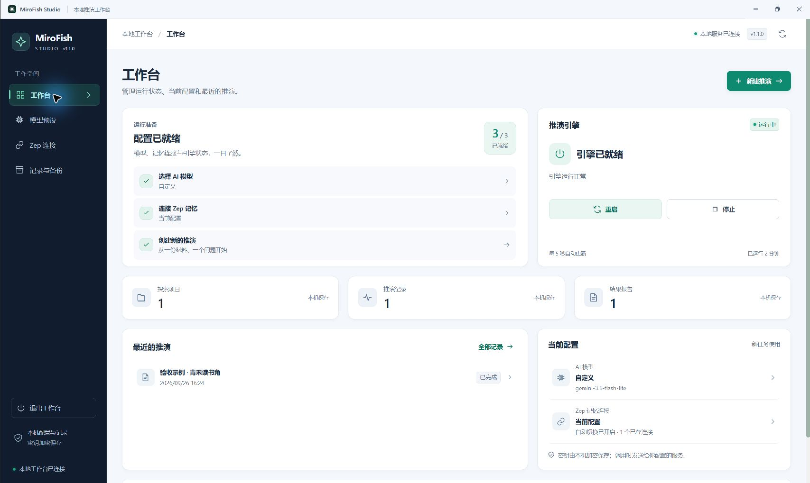

# MiroFish Studio for Windows

面向 Windows 的 MiroFish 桌面工作台。通过独立软件窗口管理模型预设、Zep 连接、推演引擎和记录备份，提供托盘与窗口操作，无需打开浏览器控制台。

本仓库是基于 [MiroFish](https://github.com/666ghj/MiroFish) 的**非官方 Windows 改版**。正式使用入口是桌面应用，安装包通过本仓库的 GitHub Releases 分发。

[下载安装](https://github.com/lu0973-cb02d/mirofish-studio-windows/releases) · [使用说明](./STUDIO_README.md) · [版本说明](./RELEASE_NOTES.md) · [来源与许可证](./NOTICE.md)

## 选择安装包

支持 Windows x64。首次使用推荐 **Full Setup**。

| Release 附件 | 用途 | 运行条件 |
| --- | --- | --- |
| MiroFish-Studio-Full-版本号-Setup.exe | 安装完整桌面版，创建快捷方式 | 包含 Studio、MiroFish 核心、Python 及依赖，无需另装开发环境 |
| MiroFish-Studio-Full-版本号-Portable.exe | 完整桌面版免安装运行 | 首次启动需要解压内置运行环境；数据仍保存在当前 Windows 用户目录 |
| MiroFish-Studio-Panel-版本号-Setup.exe | 只安装桌面控制面板 | 需要已有的 Studio 兼容工作目录和后端运行环境 |
| MiroFish-Studio-Panel-版本号-Portable.exe | 控制面板免安装运行 | 与 Panel Setup 相同，首次启动选择兼容工作目录 |

**Panel 不能直接配合未经适配的上游原版目录使用。** 所选目录需包含本改版的 local_studio/server.py、backend 和已安装依赖的 Python 环境；没有这些文件时请选择 Full。

在 [Releases](https://github.com/lu0973-cb02d/mirofish-studio-windows/releases) 下载 EXE 附件。Source code 压缩包是源码，不是安装包。安装包当前未使用发布者证书签名，Windows 可能显示未知发布者提示；可使用同一 Release 附带的 SHA256SUMS.txt 核验下载文件。

## 主要功能

- **桌面工作台**：查看引擎状态，启动、停止或重启；深色侧栏、清晰状态、悬停与按下反馈、页面切换动画，支持系统减少动态效果设置。
- **模型预设**：保存多组 Base URL、API Key 和模型名称，一键切换；获取服务商模型列表，也可手动填写。接口需兼容 OpenAI 聊天接口。
- **Zep 连接**：保存多个连接、按项目分组；遇到授权拒绝、限流或暂时故障时冷却异常连接，并尝试符合条件的备用密钥。
- **推演流程**：材料输入、图谱构建、环境准备、双线推演、报告与采访；集中查看本机项目和报告。
- **记录备份**：手动备份、按变化自动备份、文件哈希校验、恢复前回退备份及恢复失败回滚。

## 第一次使用

1. 安装 Full Setup 并打开 **MiroFish Studio（全量版）**；Panel 用户打开软件后先选择兼容工作目录。
2. 在「模型预设」添加名称、服务地址和 API Key，点击「获取模型」或手动输入模型名，测试并保存，再「设为当前」。
3. 在「Zep 连接」保存自己的密钥并设为当前。需要轮换时添加备用连接，开启自动切换。
4. 回到「工作台」启动推演引擎，再点击「新建推演」，填写材料和研究问题。建议先用少量轮次确认自己的服务配置。
5. 在「记录与备份」查看项目和备份。关闭窗口会留在托盘；需要停止后台服务时，使用软件或托盘中的退出操作。

连接测试会发送实际请求，模型测试和推演可能产生服务商费用。本版本未使用真实模型或 Zep 密钥完成付费推演验收；请先测试你自己的接口配置。

同一 Zep 连接组中的备用密钥必须能够访问同一项目和原图谱。不同账号或项目的密钥请分组保存；切换账号不能自动迁移云端图谱。任务进行中不能切换当前配置或重启引擎；已完成推演保留的采访环境在停止、重启或退出后会关闭。

## 隐私与数据位置

API Key 使用当前 Windows 用户的 DPAPI 加密保存，不在编辑界面回显已有密钥。调用模型与 Zep 时，密钥和必要材料会发送给你配置的服务，因此请使用可信的服务地址。发布范围是程序源码、界面和通用依赖，首次使用需自行填写连接配置。

Full 版数据根目录为 %APPDATA%\mirofish-studio-desktop\data；Panel 使用所选工作目录保存数据。以下路径相对于各自的数据根目录：

| 路径 | 内容 |
| --- | --- |
| studio_data | 模型与 Zep 配置、运行信息 |
| backend/uploads | 项目材料、推演记录与报告 |
| record_backups | 本地记录备份 |

Full Portable 的数据不会随 EXE 文件一起搬迁。换电脑或换 Windows 用户时，应通过记录备份迁移数据并重新填写密钥；不要将 .env、配置、上传文件或备份提交到公开仓库。

## 备份恢复与中断边界

工作台运行时每 15 分钟检查记录变化，有变化才自动备份；保留最近 20 份自动备份，手动备份不会自动清理。恢复前需停止引擎；系统先备份当前记录，再校验并恢复所选备份。

短暂断线或重新打开工作台后，可以读取仍在运行的任务和已保存记录。**程序崩溃或电脑关机后，不保证从中间轮次续跑**；恢复记录也不等于恢复内存中的采访环境。

记录备份不包含 API Key，也不包含 Zep 云端图谱内容。原 Zep 账号或云端图谱不可用时，仅恢复本地备份无法恢复云端访问。本机备份也无法防止整块磁盘损坏，重要备份请另存一份。详细操作见 [工作台使用说明](./STUDIO_README.md)。

## 从源码构建

以下步骤面向开发者。普通使用者直接下载安装包即可。

构建环境：Windows x64、Node.js 22、Python 3.11 x64、uv。在不含个人配置或记录的源码副本中，从仓库根目录依次执行：

~~~powershell
npm ci --prefix frontend
npm ci --prefix desktop
uv sync --project backend --frozen
npm --prefix frontend run build
npm run desktop:build
~~~

每一步成功后再继续。输出位于 dist-installers/panel 和 dist-installers/full。仅构建一版可使用 npm run desktop:build:control 或 npm run desktop:build:full；桌面开发预览使用 npm run desktop:dev。

源码测试：

~~~powershell
uv run --project backend --frozen python -m pytest -q
python scripts/audit-release.py
~~~

GitHub Actions 按发布标签签出源码，执行测试、扫描、构建和全量安装包启动/卸载检查，核对上传文件哈希后发布。具体入口及验收边界见 [Windows 打包说明](./packaging/WINDOWS_PACKAGING.md) 和 [桌面端开发说明](./desktop/README.md)。SHA256SUMS.txt 以对应 Release 附件为准，本地重新构建的文件哈希可能不同。

## 许可证与上游来源

仓库主体按 [GNU AGPL-3.0](./LICENSE) 发布，保留上游版权与许可证声明；第三方运行时和依赖按各自许可证分发。Windows 桌面体验层及本地流程改动的说明见 [NOTICE.md](./NOTICE.md)，采用的上游源码快照见 [source_info.json](./source_info.json)。

本项目不是 MiroFish 官方 Windows 发行版。请在[本仓库 Issues](https://github.com/lu0973-cb02d/mirofish-studio-windows/issues)反馈桌面版问题；提交日志或截图前请移除密钥、个人材料和推演隐私内容。
